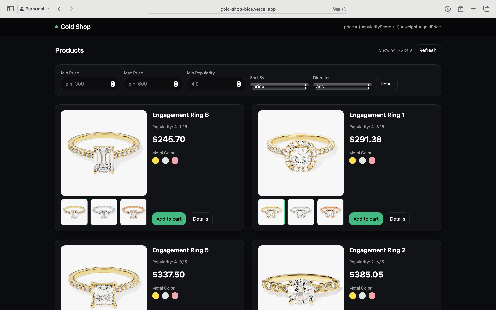

# Gold Shop — Full-Stack Case Study

## Live Links
- **Frontend (Vercel):** [https://gold-shop-bice.vercel.app](https://gold-shop-bice.vercel.app)
- **GitHub Repo:** [https://github.com/emirayemr/goldshop](https://github.com/emirayemr/goldshop)
- **Backend (Railway):** [https://goldshop-production.up.railway.app](https://goldshop-production.up.railway.app)

> **Not:** Backend Railway üzerinde 7/24 çalışır durumdadır.  
> Ücretsiz planda ilk istekte uyanma süresi (3–10 sn) olabilir.

---

## 📌 Proje Özeti
**Gold Shop**, ürün fiyatlarını **altın gram fiyatı** ve **popülerlik skoruna** göre dinamik olarak hesaplayan bir tam-yığın (full-stack) web uygulamasıdır.  
Kullanıcılar ürünleri filtreleyebilir, sıralayabilir ve metal rengine göre önizleyebilir.

**Fiyat formülü**
```
priceUsd = (popularityScore + 1) × weight × goldPrice
```

---

## 🏗️ Teknoloji Yığını
**Frontend:** React + TypeScript + Vite + TanStack Query + TailwindCSS  
**Backend:** Spring Boot 3.5 (Java 17, Maven, Spring Web, Actuator)  
**Yayınlama:** Vercel (Frontend) + Railway (Backend)

---

## ✨ Özellikler
- Ürün kartları (büyük görsel + alt thumb carousel)  
- Metal renk seçimi (yellow / white / rose)  
- **Filtreler:** min/max price, min popularity  
- **Sıralama:** price | popularity (asc / desc)  
- **Dinamik fiyat:** altın fiyatı cache + fallback  
- Swagger UI ve Health endpoint’leri  
- Responsive, modern UI  

---

## 🧠 API
### `GET /api/products`

| Parametre | Tip | Açıklama |
|------------|------|----------|
| `minPrice` | number | Alt sınır fiyat |
| `maxPrice` | number | Üst sınır fiyat |
| `minPopularity` | number | 0–5 arası popülerlik eşiği |
| `sort` | string | `price` veya `popularity` |
| `dir` | string | `asc` veya `desc` |

**Örnek istek**
```
/api/products?minPrice=200&maxPrice=800&minPopularity=3.5&sort=price&dir=asc
```

### Health Control
`GET /actuator/health` → son başarılı fetch zamanı, altın fiyatı ve hata mesajı bilgilerini döner.

---

## 🖥️ Lokal Geliştirme
> Gerekenler: Node 18+ ve JDK 17

```bash
# Backend
cd goldshop
./mvnw spring-boot:run

# Frontend
cd goldshop/frontend
npm install
npm run dev
```

**Frontend .env**
```
VITE_API_BASE_URL=http://localhost:8080
```

---

## 🚀 Yayınlama Notları

### Frontend (Vercel)
- Root directory: `goldshop/frontend`  
- Build: `vite build`  
- Env var:
  ```
  VITE_API_BASE_URL=https://goldshop-production.up.railway.app
  ```
- Kaydet → Redeploy  

### Backend (Railway)
- **Build Command:** `./mvnw clean package -DskipTests`  
- **Start Command:** `java -jar target/*.jar`  
- **Environment Variable:** `PORT=8080`  
- **Java Version:** 17 (Otomatik)  

> Railway ücretsiz planlarda ilk istekte uyanabilir, sonrasında kesintisiz çalışır.

---

## 📸 Ekran Görüntüsü


---

## 👤 Yazar
**Emir Ay**  
GitHub: [emirayemr](https://github.com/emirayemr)  
LinkedIn: [https://www.linkedin.com/in/emir-ay/](https://www.linkedin.com/in/emir-ay/)
